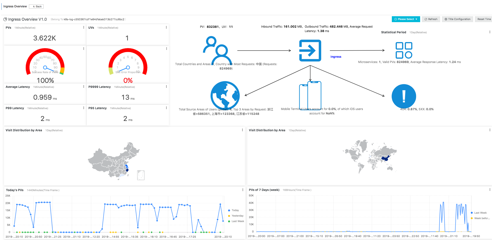

## alibaba-cloud-metrics-adapter [Alpha]

[](https://www.apache.org/licenses/LICENSE-2.0.html)
[](https://travis-ci.org/AliyunContainerService/alibaba-cloud-metrics-adapter)


###  Overview 
An implementation of the Kubernetes [Custom Metrics API and External Metrics API](https://kubernetes.io/docs/tasks/run-application/horizontal-pod-autoscale/#support-for-metrics-apis) for Alibaba Cloud.This adapter enables you to scale your application pods running on ACK using the Horizontal Pod Autoscaler (HPA) with External Metrics such as ingress QPS, ARMS jvm RT and so on.

### Installation 
```$xslt
kubectl apply -f deploy/deploy.yaml 
```
### Example 
Here is an example about HPA base on Ingress QPS metric. Ingress Controller(Nginx) is a common gateway solution in kubernetes. How to autoscale your workload based on Ingress route QPS gets everyone's attention. If we collect metric in Ingress Controller that might consume too much performance. So we collect Ingress log to SLS (Log Service),analysis and make up metrics such as sls_ingress_qps,sls_ingress_latency_avg and so on. The external metrics can help developers from a different angle.

#### step1: create a ack cluster with SLS integratation on 
[switch on Ingress Dashboard](https://www.alibabacloud.com/help/doc-detail/86532.html?spm=a2c5t.11065259.1996646101.searchclickresult.2f0570acygCy4j) and here is the snapshot of Ingress Dashboard. You can continue the next step when the dashboard is ready. 

    

#### step2: deploy the workload and configure hpa with appropriate parameters     

```yaml
apiVersion: autoscaling/v2beta2
kind: HorizontalPodAutoscaler
metadata:
  name: ingress-hpa
spec:
  scaleTargetRef:
    apiVersion: apps/v1beta2
    kind: Deployment
    name: nginx-deployment-basic
  minReplicas: 2
  maxReplicas: 10
  metrics:
    - type: External
      external:
        metric:
          name: sls_ingress_qps
          selector:
            matchLabels:
              #sls.project: "k8s-log-c550367cdf1e84dfabab013b277cc6bc2"
              sls.project: ""
              #sls.logstore: "nginx-ingress"
              sls.logstore: ""
              #sls.ingress.route: "default-nginx-80"
              sls.ingress.route: ""
        target:
          type: AverageValue
          averageValue: 10
    - type: External
      external:
        metric:
          name: sls_ingress_latency_p9999
          selector:
            matchLabels:
              # default ingress log project is k8s-log-clusterId
              # such as: sls.project: "k8s-log-c550367cdf1e84dfabab013b277cc6bc2"
              sls.project: ""
              # default ingress logstre is nginx-ingress
              # such as: sls.logstore: "nginx-ingress"
              sls.logstore: ""
              # namespace-svc-port
              # such as: sls.ingress.route: "default-nginx-80"
              sls.ingress.route: ""
        target:
          type: Value
          # sls_ingress_latency_p9999 > 10ms
          value: 10
```     

Fill the blank in matchLabels with the metadata of your cluster and deploy the yaml file.     

```
kubectl apply -f examples/sls.yaml 
```    

#### step3: check the result     
Use some of stress tool to test the URL of your Ingress service.

```
Name:                                          ingress-hpa
Namespace:                                     default
Labels:                                        <none>
Annotations:                                   <none>
CreationTimestamp:                             Wed, 07 Aug 2019 20:03:56 +0800
Reference:                                     Deployment/nginx-deployment-basic
Metrics:                                       ( current / target )
  "sls_ingress_qps" (target average value):    7875m / 10
  "sls_ingress_latency_p9999" (target value):  10 / 10
Min replicas:                                  2
Max replicas:                                  10
Deployment pods:                               8 current / 8 desired
Conditions:
  Type            Status  Reason              Message
  ----            ------  ------              -------
  AbleToScale     True    ReadyForNewScale    recommended size matches current size
  ScalingActive   True    ValidMetricFound    the HPA was able to successfully calculate a replica count from external metric sls_ingress_latency_p9999(&LabelSelector{MatchLabels:map[string]string{sls.ingress.route: default-nginx-80,sls.logstore: nginx-ingress,sls.project: k8s-log-c550367cdf1e84dfabab013b277cc6bc2,},MatchExpressions:[],})
  ScalingLimited  False   DesiredWithinRange  the desired count is within the acceptable range
Events:
  Type    Reason             Age   From                       Message
  ----    ------             ----  ----                       -------
  Normal  SuccessfulRescale  16s   horizontal-pod-autoscaler  New size: 4; reason: external metric sls_ingress_qps(&LabelSelector{MatchLabels:map[string]string{sls.ingress.route: default-nginx-80,sls.logstore: nginx-ingress,sls.project: k8s-log-c550367cdf1e84dfabab013b277cc6bc2,},MatchExpressions:[],}) above target
  Normal  SuccessfulRescale  10s   horizontal-pod-autoscaler  New size: 8; reason: external metric sls_ingress_qps(&LabelSelector{MatchLabels:map[string]string{sls.ingress.route: default-nginx-80,sls.logstore: nginx-ingress,sls.project: k8s-log-c550367cdf1e84dfabab013b277cc6bc2,},MatchExpressions:[],}) above target
```

### Cloud Resource Metrics List
* <a href="docs/metrics/sls.md">Ingress（SLS)</a>
* <a href="docs/metrics/slb.md">SLB</a>
* <a href="docs/metrics/ahas_sentinel.md">AHAS Sentinel</a>

### Custom Metrics
* <a href="docs/metrics/arms_prometheus.md">arms prometheus</a>

### Contributing 
Please check <a href="docs/CONTRIBUTING.md">CONTRIBUTING.md</a>

### License 
This software is released under the Apache 2.0 license.
